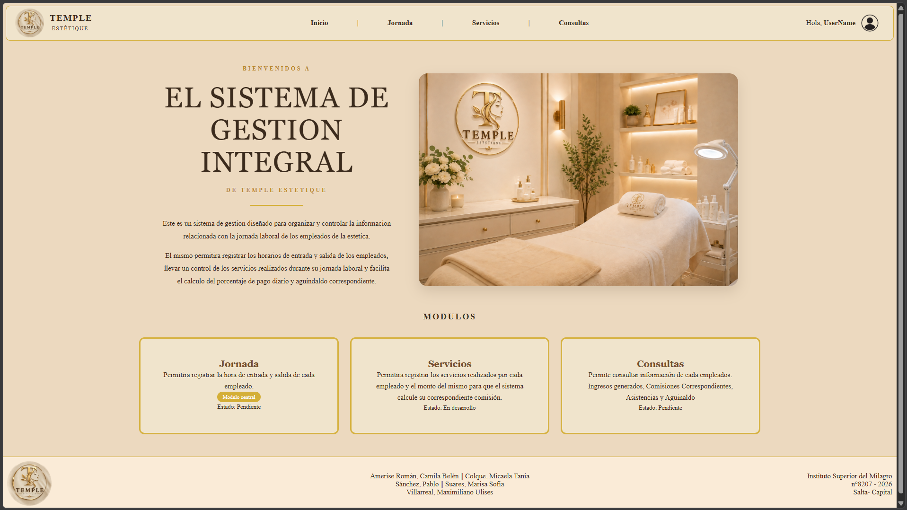

# Sistema de gestion de Sueldos

## Temple Estetique

### Integrantes:

- Amerise Román, Camila Belén 
- Colque, Micaela Tania
- Sánchez, Pablo 
- Suares, Marisa Sofía
- Villarreal, Maximiliano Ulises

### Descripción:

Este sistema se está desarrollando para una estética llamada **TEMPLE ESTETIQUE** con la finalidad de brindar a la administracion un medio sensillo y semiautomático de gestionar los servicios e ingresos de cada uno de los empleados de la misma, ademas de tener un registro de asistencias y un calculo automatico de aguinaldos.
Por otra parte, también permite a los empleados poder consultar en cualquier momento los ingresos efectuados durante sus jornadas y su correspondiente aguinaldo de forma transparente.

### Comandos para ejecutar el proyecto

1. **nmp install**

2. **npm run dev**

### Proyecto en funcionamiento:

